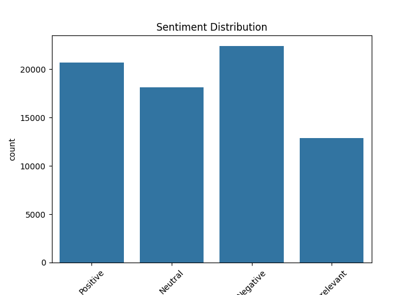
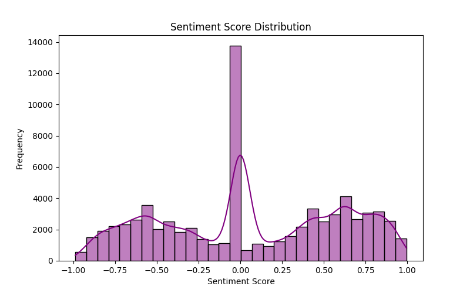

# 💬 Sentiment Analysis on Twitter Data

> 🧠 A Natural Language Processing (NLP) project to analyze and visualize sentiment trends in social media data.

---

## 📌 Project Overview

This project focuses on analyzing **public sentiment on Twitter** by performing sentiment classification and generating visual insights.

Using the **VADER Sentiment Analyzer** from NLTK, the tweets are classified into:
- **Positive**
- **Negative**
- **Neutral**

Key insights were extracted using visualization techniques to understand public opinion trends around certain topics or brands.

---

## 🗂️ Dataset

**Twitter Sentiment Dataset**
- `twitter_training.csv` – Training data for sentiment classification
- `twitter_validation.csv` – Validation dataset for testing model generalization

Visual Outputs:
- `sentiment_distribution.png` – Distribution of classified sentiments
- `sentiment_score_distribution.png` – Histogram of sentiment polarity scores

---

## 🧹 Workflow Summary

### 🔄 Data Preprocessing
- Cleaned tweets (removing URLs, mentions, emojis, etc.)
- Tokenized and normalized text
- Removed stopwords

### 🔍 Sentiment Classification
- Used **NLTK’s VADER SentimentIntensityAnalyzer**
- Classified tweets into **Positive**, **Negative**, or **Neutral** based on compound score

### 📊 Visualization
- Bar charts showing sentiment class distribution
- Histograms of sentiment scores
- (Optional: Word clouds for top positive/negative keywords)

---

## 🛠️ Tools & Libraries Used

| Tool / Library   | Purpose                              |
|------------------|--------------------------------------|
| 🐍 Python         | Programming Language                 |
| 📚 Pandas         | Data Handling & Manipulation         |
| 🧠 NLTK + VADER    | Sentiment Analysis (Rule-Based NLP)  |
| 📊 Matplotlib     | Plotting                            |
| 🌈 Seaborn        | Advanced Statistical Visualization  |
| ☁️ WordCloud      | Word Frequency Visualization        |
| 💻 VS Code        | Development Environment              |

---

## 🔍 Key Insights

- ✅ Detected sentiment polarity trends across tweets
- ✅ Most tweets were classified as Neutral, followed by Positive
- ✅ Visualized the distribution of sentiment scores for better interpretability

---

## 📈 Sample Outputs

---

## 🧑‍💻 Author

**Madhavan N**  
_B.Tech in AI & DS | NLP & Data Science Enthusiast_  
📍 [GitHub – madhavan1402](https://github.com/madhavan1402)

---

